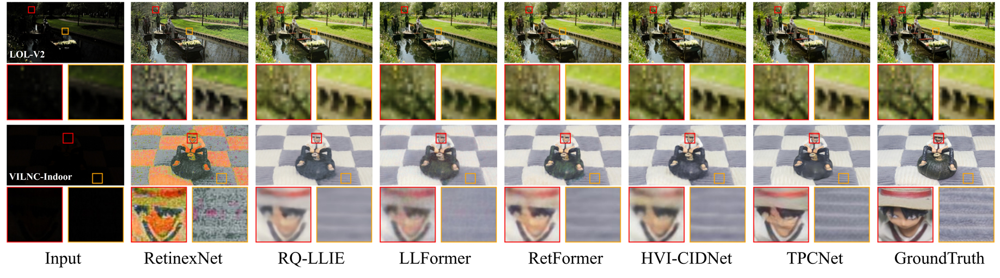
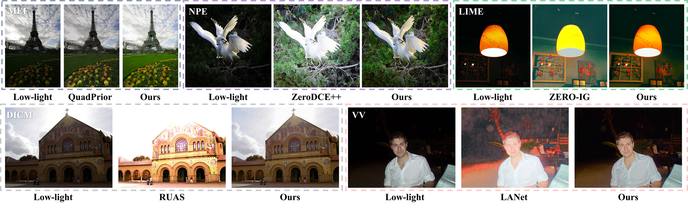

# TPCNet: Triple physical constraints for Low-light Image Enhancement ✨

This repository contains the implementation of our submission. We provide code, pretrained models, and instructions for reproducing the main experimental results.  


## Proposed TPCNet 

<details close>
<summary><b>TPCNet framework:</b></summary>


</details>

## Visual Comparison 📈

<details close>
<summary><b>LOL-v2-synthetic and VILNC-Indoor:</b></summary>



</details>

<details close>
<summary><b>DICM, LIME, MEF, NPE, and VV:</b></summary>



</details>

## Weights and Results 

<details close>
<summary><b>The metrics of TPCNet on different datasets with reference images are shown in the following table: </b></summary>

| Test datasets | PSNR   | SSIM  | LPIPS | Results     | Weights Path       |
|-------|--------| ----- |-------|-------------|--------------------|
| LOL-v2-real | 24.978 | 0.882  | 0.102 | Results/LOL-v2-Real | Weight/LOLV2_R.pth |
| LOL-v2-Synthetic | 26.032 | 0.943 | 0.041 | Results/LOL-v2-Synthetic | Weight/LOLV2_S.pth |
| VILNC-Indoor | 24.634 | 0.785  | 0.194 | Results/VILNC-Indoor | Weight/VILNC.pth   |
| Sony-Total-Dark | 23.577 | 0.691 | 0.417 | Results/SID | Weight/SID.pth     |
| LCDP  | 23.398 |  0.874  | 0.069    | Results/LCDP | Weight/LCDP.pth    |

</details>

<details close>
<summary><b>Performance on five unpaired datasets are shown in the following table:  </b></summary>

| metrics | DICM   | LIME   | NPE    | MEF    | VV     | Avg   |
|---------|--------|--------|--------|--------|--------|-------|
| NIQE    | 3.596  | 3.804  | 4.241  | 3.269  | 3.215  | 3.625 |
| MUSIQ   | 58.560 | 60.026 | 68.331 | 62.589 | 40.845 | 58.070|
| PI      | 3.049  | 2.936  | 2.995  | 2.505  | 3.425  | 2.982|

</details>

## 1. Get Started 🚀

### Dependencies and Installation

- Python 3.12.11
- Pytorch 2.3.0

(1) Create Conda Environment

```bash
conda create --name TPCNet python=3.12.11
conda activate TPCNet
```

(2) Install Dependencies

```bash
pip install -r requirements.txt
```

### Data Preparation

You can refer to the following links to download the [LOLv2](https://github.com/Fediory/HVI-CIDNet), [SID (Sony-Total-Dark)](https://github.com/Fediory/HVI-CIDNet), and [LCDP](https://github.com/onpix/LCDPNet) datasets. We provided the **VILNC-Indoor** dataset in file Test_dataset, which can be used to test.

## 2. Testing 🛠

- **The example for fast testing.**
```bash
python Test.py --save_path Results/VILNC-Indoor --target_path Test_dataset/VILNC_Indoor/Test/Normal --test_type woR
```
- **Calculating the Parameters (M) and FLOPs (G) of TPCNet:**
```bash 
python calculate_model_complexity.py
```
- **Evaluating other results reported in our submission.**

First, you need to prepare the dataset and adjust the path data_dir in option/.yml file. Then run the following command:

```bash
# for the paired datasets reconstruction 
# if for the unpaired dataset, the command need to add --Unpaired
python Test.py --yaml_path yaml_path --target_path target_path --weight_path weight_path --save_path save_path --test_type R

# for testing the unpaired datasets metrics
python Test.py --Unpaired_path unpaired_path --Unpaired_metrics niqe musiq pi --test_type Unpaired
```


